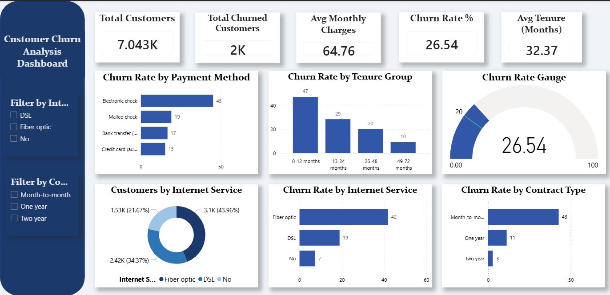

# 📊 Customer Churn Analysis


## 🔗 Live Demo
👉 **[Launch Streamlit App](https://ankita-customer-churn.streamlit.app)**

## 📌 Project Overview
This project analyzes customer churn for a telecom company using the Kaggle Telco Customer Churn dataset. The goal is to identify key churn drivers and predict which customers are likely to leave.

## 🎯 Key Findings
- 📌 **26.5%** of customers churned
- 📌 Month-to-month customers churn at **42.7%** — highest risk
- 📌 Fiber optic users churn at **41.9%**
- 📌 Electronic check users churn at **45.3%**
- 📌 Customers in first **3 months** have **50%+** churn risk
- 📌 Senior citizens churn at **41.7%**

## 🛠️ Tech Stack
| Tool | Purpose |
|------|---------|
| Python | EDA, cleaning, modeling |
| Pandas, NumPy | Data manipulation |
| Matplotlib, Seaborn | Static visualizations |
| Plotly | Interactive charts |
| Scikit-learn | ML model |
| Power BI | Interactive dashboard |
| Streamlit | Web app deployment |

## 📁 Project Structure
```
customer-churn-analysis/
├── data/
│   ├── raw/
│   └── cleaned/
├── notebooks/
│   ├── 01_EDA_and_Data_Cleaning.ipynb
│   └── 02_Statistical_Analysis_and_Modeling.ipynb
├── src/
│   ├── figures/
│   └── models/
├── dashboard/
├── app/
│   ├── app.py
│   └── requirements.txt
└── README.md
```
## 📊 Power BI Dashboard


## 🤖 ML Model Performance
| Metric | Score |
|--------|-------|
| Accuracy | 80.70% |
| Precision | 65.94% |
| Recall | 56.42% |
| F1 Score | 60.81% |
| ROC-AUC | **84.18%** |

## 🚀 How to Run Locally
```bash
git clone https://github.com/DaweAnki/customer-churn-analysis.git
cd customer-churn-analysis
pip install -r app/requirements.txt
python -m streamlit run app/app.py
```

## 👩‍💻 Author
**Ankita Daweshar**
- 🔗 [LinkedIn](https://www.linkedin.com/in/ankita-daweshar-4a820b318/)
- 🐙 [GitHub](https://github.com/DaweAnki)
